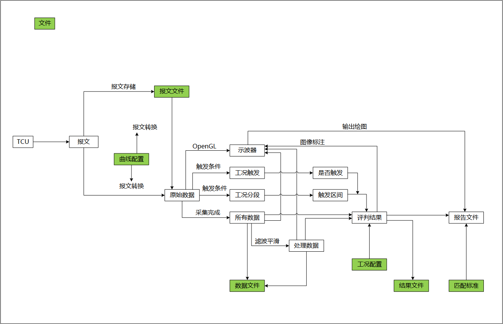
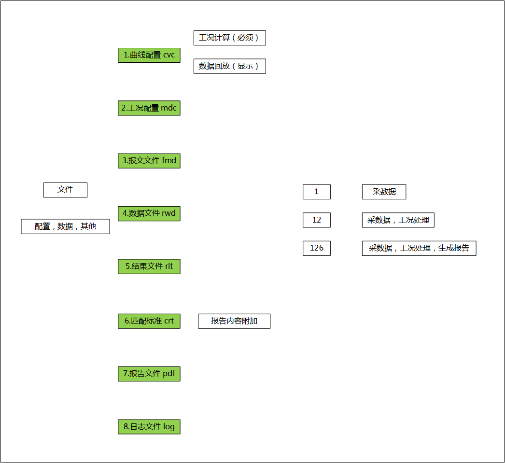
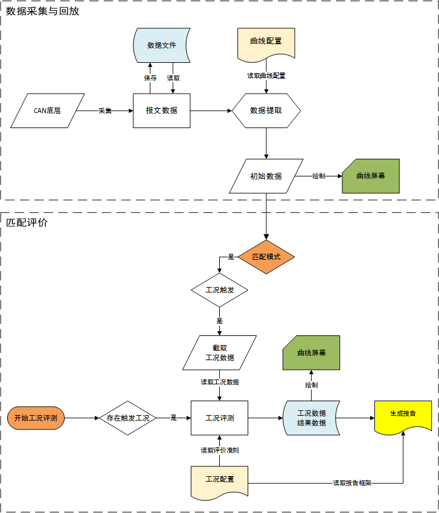
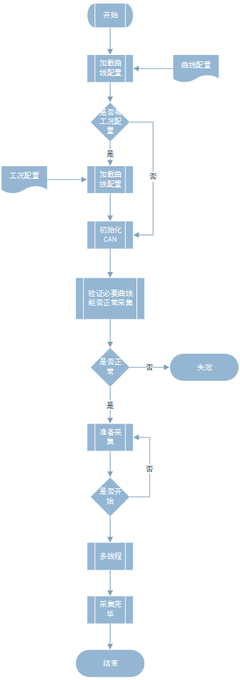
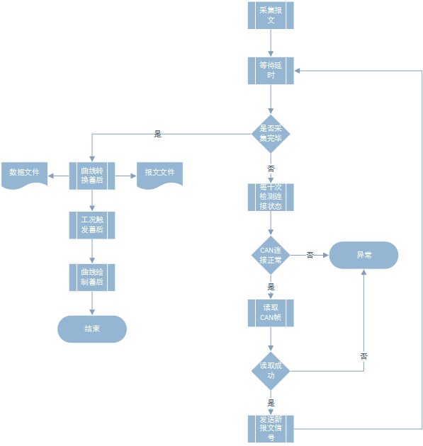
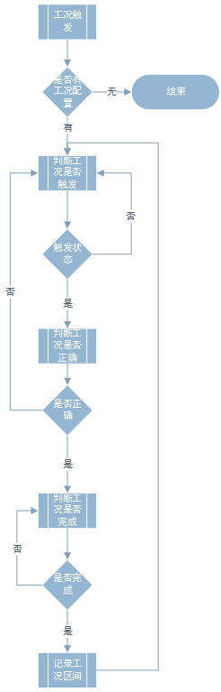
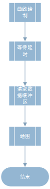
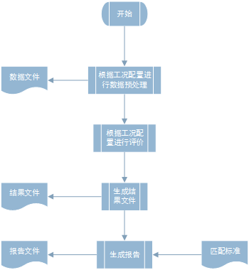

# Refine

## 简介

匹配工况用的软件，主要实现以下功能：

**主要功能**：

1. 数据采集和回放
2. 根据采集的数据根据配置进行评分计算
3. 评分结果生成pdf文档

**其他功能**：

1. 匹配结果汇总

用到的框架和开发平台：

- Qt
- MinGW
- CMake

目前还在开发阶段

## 设计

软件的核心功能如图

文件设置：

目前基本上所有的环节都打通了：

1. CAN盒的控制
2. 曲线配置读取写入
3. 报文转换
4. OpenGL绘图
5. 界面布局和设计
6. 

猛哥的设计方案：

程序核心功能计划实现（updating）：

初始化：

开始采集：

线程部分：

报文采集

曲线转换

工况触发

曲线显示

工况评价

