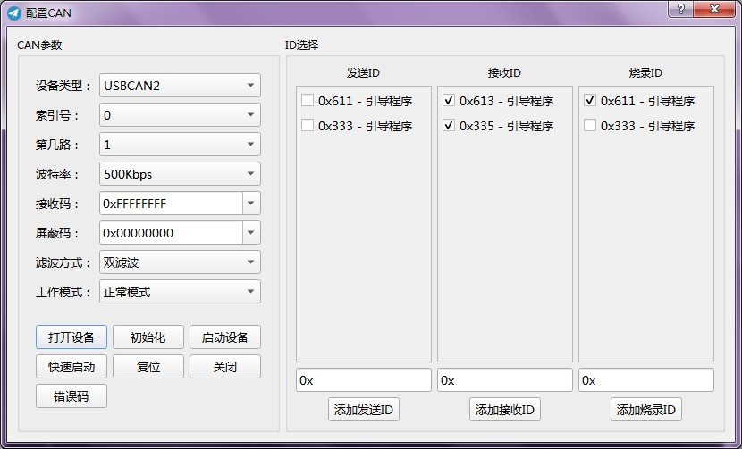
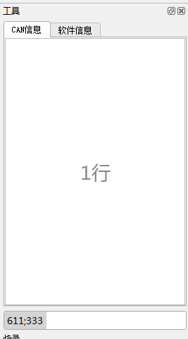

# Refine

## 简介

匹配工况用的软件，主要实现以下功能：

**主要功能**：

1. 数据采集和回放
2. 根据采集的数据根据配置进行评分计算
3. 评分结果生成pdf文档

**其他功能**：

1. 匹配结果汇总

用到的框架和开发平台：

- Qt
- MinGW
- CMake

目前还在开发阶段

## 当前进度

- 曲线查看缩放功能已基本实现

-----

# 变更列表

倒过来方便阅读

---

v0.1.3 

1. 增加CAN配置面板，包括打开、初始化、启动、快速启动等等

   

2. 发送ID显示到发送框，并且支持多个发送ID，多个接收ID和单个烧录ID(还没完) 

   

2018/1/8 

---

## v0.1.2 

1. 增加绘图区右键菜单 
2. 增加截图功能，包括截取到剪贴板，桌面和自定义保存格式 
3. 增加正常情况下的烧录功能 

2018/1/3 

---

## v0.1.1 

1. 修复采数据时和采集第二次数据时缩放崩溃 
2. 流操作符，封印！ 
3. 文件采取向下兼容设计，根据版本号判断 
4. 增加反馈功能 
5. 增加部分界面 
6. 优化绘图的显示 

2018/12/21 

---

## v0.1.0 

1. 优化游标数据显示，缩小阴影面积 
2. 可以在采数据的时候任意缩放了 

2018/12/19 

## v0.0.6

1. 重新设计UI和底层处理方法
2. 采数据按照固定时钟采样，对于丢失的数据补上，多出的丢弃
3. 增加定时器功能用于计时测试
4. 增加版本变更记录菜单实现

2018/10/30

------

## v0.0.7

1. 改写线程重复创建销毁为线程内循环，减少开支
2. 增加曲线列表窗口
3. 增加工具栏和侧边窗口的隐藏显示
4. 增加重绘间隔设置菜单，并使用单选

2018/10/31

------

## v0.0.8

1. 修复刷新时数组越界的问题
2. 修复开始采集不动的问题，return改为continue
3. 增加将数据文件打包为一个文件的功能
4. 日志窗可以查看输出文件的位置
5. 底层的曲线存储类添加曲线配置部分副本

2018/11/02

------

## v0.0.9

1. 使用菜单组代替一个个触发
2. 增加曲线配置编辑功能，还未写完整
3. 右侧曲线配置表颜色块修复不能点击
4. MVC模式设计已经可以读取自定义数据结构，代理还未设计

2018/11/06

------

## v0.0.10

1. 曲线配置编辑器的代理已经设置好
2. 曲线列表窗口可以正常显示曲线了
3. 曲线显示和曲线配置没关系了，由曲线的风格设置来确定

2018/11/08

------

## v0.0.11

1. 绘图区的滚动条可以使用
2. 导入导出曲线配置和数据可以使用，支持CSV导出
3. 修复绘图只画竖线的问题
4. 所有的控件和菜单全部翻译为中文

2018/11/12

------

## v0.0.12

1. 将数据的纵坐标按照10格绘制出来，并且能根据表格切换坐标
2. 游标能够显示当前位置的数据，和SoftCAN一样
3. 添加菜单和工具栏的小图标，增加软件可用性

2018/11/15

------

## v0.0.13

1. 修复由于QOpenGLWidget导致全屏不显示菜单的bug(鼠标放上去能操作)
2. 纵坐标范围小于10的曲线会根据范围大小绘制纵坐标，不会仍旧画10条(逻辑值)
3. 游标变得智能，碰到边缘会调整数据显示位置
4. 曲线转换发现重大bug，不能转换有符号数(已修复)
5. 增加搜索框，增加排序类

2018/11/19

------

## v0.0.14

1. 搜索框添加自动补全
2. 曲线搜索框可以根据选中情况和内容大小写以及不同语法进行内容筛选
3. 曲线表格内容可以用表头进行排序，最有用的比如根据颜色列排序可以把相同颜色的曲线排列到一起
4. 修改看图的逻辑使得曲线绘制更流畅

2018/11/20

------

## v0.0.15

1. 能够直接读取SoftCAN数据
2. 修复proxy和source model之间的selection映射问题
3. 改进Softcan读取类的识别机制
4. 曲线配置表格的增加和删除实现
5. 演示模式设计完毕，F12启用和关闭
6. 添加波特率显示，但暂停采集时会不计算

2018/11/22

------

## v0.0.16

1. 修复SoftCAN导入曲线数据长度不一使得查看崩溃的问题
2. 分割画布，使得可以左右绘制多坐标
3. 演示模式下不显示菜单的问题待修复
4. 预先转换好曲线数据，方便设置顶点数组和缓冲区

2018/11/30 

---

## v0.0.17

1. 增加屏幕常亮功能
2. 放大到一定程度显示点，并且只显示采集到的数据点
3. 修复演示模式不显示菜单的问题
4. 按键缩放功能完成，横向网格完成
5. 横坐标轴完成，纵向向网格完成

2018/12/06 

---

## v0.0.18 

1. 增加曲线精度这一配置
2. 增加Y轴缩放
3. 增加xy轴缩放锁定菜单

2018/12/10 

---

## v0.0.19

1. xy轴+-号根据游标位置缩放
2. 鼠标滚轮缩放根据鼠标位置

2018/12/13

---

## v0.0.20

1. 优化游标数据显示，缩小阴影面积
2. 消除对话框后不小心拖动会不能清除放大状态的bug
3. 坐标轴名称移动到上面，可以完整显示，多坐标也方便显示
4. 修复一堆下标溢出导致的崩溃
5. 调整Y轴使其更加紧凑
6. 调整X轴使最后一个刻度能显示出来
7. 设计样式让进度条更明显
8. 增加鼠标中建按住拖动平移功能
9. 绘制横坐标点数过多时采用抽样绘制方式增加绘制性能和减少内存
10. 读取SoftCAN数据也会导入配置
11. 读取完SoftCAN数据后会释放掉相应的内存
12. 优化网格显示
13. 保证游标能显示选中的曲线数据，不管勾选多少曲线
14. 修复放大率很高时鼠标中键难以移动的问题

2018/12/14

---

